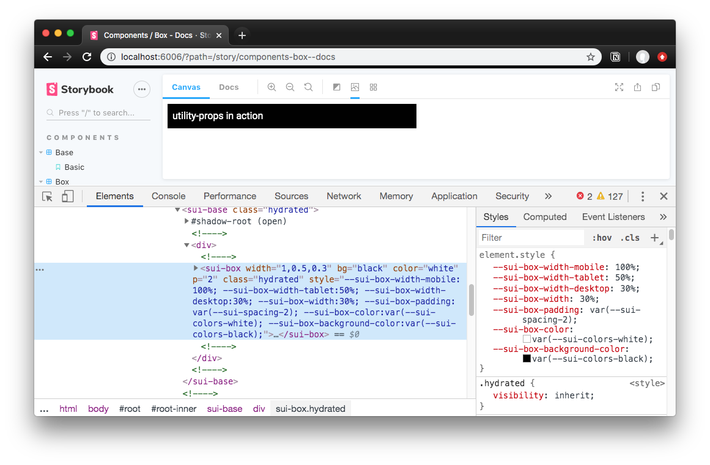

![Built With Stencil](https://img.shields.io/badge/-Built%20With%20Stencil-16161d.svg?logo=data%3Aimage%2Fsvg%2Bxml%3Bbase64%2CPD94bWwgdmVyc2lvbj0iMS4wIiBlbmNvZGluZz0idXRmLTgiPz4KPCEtLSBHZW5lcmF0b3I6IEFkb2JlIElsbHVzdHJhdG9yIDE5LjIuMSwgU1ZHIEV4cG9ydCBQbHVnLUluIC4gU1ZHIFZlcnNpb246IDYuMDAgQnVpbGQgMCkgIC0tPgo8c3ZnIHZlcnNpb249IjEuMSIgaWQ9IkxheWVyXzEiIHhtbG5zPSJodHRwOi8vd3d3LnczLm9yZy8yMDAwL3N2ZyIgeG1sbnM6eGxpbms9Imh0dHA6Ly93d3cudzMub3JnLzE5OTkveGxpbmsiIHg9IjBweCIgeT0iMHB4IgoJIHZpZXdCb3g9IjAgMCA1MTIgNTEyIiBzdHlsZT0iZW5hYmxlLWJhY2tncm91bmQ6bmV3IDAgMCA1MTIgNTEyOyIgeG1sOnNwYWNlPSJwcmVzZXJ2ZSI%2BCjxzdHlsZSB0eXBlPSJ0ZXh0L2NzcyI%2BCgkuc3Qwe2ZpbGw6I0ZGRkZGRjt9Cjwvc3R5bGU%2BCjxwYXRoIGNsYXNzPSJzdDAiIGQ9Ik00MjQuNywzNzMuOWMwLDM3LjYtNTUuMSw2OC42LTkyLjcsNjguNkgxODAuNGMtMzcuOSwwLTkyLjctMzAuNy05Mi43LTY4LjZ2LTMuNmgzMzYuOVYzNzMuOXoiLz4KPHBhdGggY2xhc3M9InN0MCIgZD0iTTQyNC43LDI5Mi4xSDE4MC40Yy0zNy42LDAtOTIuNy0zMS05Mi43LTY4LjZ2LTMuNkgzMzJjMzcuNiwwLDkyLjcsMzEsOTIuNyw2OC42VjI5Mi4xeiIvPgo8cGF0aCBjbGFzcz0ic3QwIiBkPSJNNDI0LjcsMTQxLjdIODcuN3YtMy42YzAtMzcuNiw1NC44LTY4LjYsOTIuNy02OC42SDMzMmMzNy45LDAsOTIuNywzMC43LDkyLjcsNjguNlYxNDEuN3oiLz4KPC9zdmc%2BCg%3D%3D&colorA=16161d&style=flat-square)

# Utility Web Components

Component library built using Web Components and [utility-props](https://www.npmjs.com/package/utility-props). Build and style your app with flexible and declarative components using "utility CSS" style props.

```js
<sui-box width={[1, 0.5, 0.3]} bg="black" color="white" p="2"></sui-box>
```

[Browse component documentation in Storybook.](http://sui-web-components.netlify.com/)

## Components

- `<sui-base>`
- `<sui-box>`
- `<sui-button>`
- `<sui-input>`
- `<sui-link>`
- `<sui-select>`
- `<sui-switch>`
- `<sui-text>`
- `<sui-textarea>`

## Getting Started

To start building a new web component using Stencil, clone this repo to a new directory:

```bash
git clone https://github.com/whoisryosuke/sui-web-components.git
cd sui-web-components
yarn
yarn start
```

To build the component for production, run:

```bash
yarn build
```

To run the unit tests for the components, run:

```bash
yarn test
```

> Need help? Check out the StencilJS docs [here](https://stenciljs.com/docs/my-first-component).

## Using these component

### Script tag

- [Publish to NPM](https://docs.npmjs.com/getting-started/publishing-npm-packages)
- Put a script tag similar to this `<script src='https://unpkg.com/sui-web-components@0.0.1/dist/mycomponent.js'></script>` in the head of your index.html
- Then you can use the element anywhere in your template, JSX, html etc

### Node Modules

- Run `npm install sui-web-components --save`
- Put a script tag similar to this `<script src='node_modules/sui-web-components/dist/mycomponent.js'></script>` in the head of your index.html
- Then you can use the element anywhere in your template, JSX, html etc

### In a stencil-starter app

- Run `npm install sui-web-components --save`
- Add an import to the npm packages `import sui-web-components;`
- Then you can use the element anywhere in your template, JSX, html etc

## Storybook

`yarn storybook`

> **Requires production build of StencilJS components** (for the `./loader/` and `./dist/` folders). Run `yarn build` before running Storybook, or after any changes to components. Can't use with StencilJS in development mode, requires different configuration, [see here.](https://whoisryosuke.com/blog/2019/using-stencil-with-storybook/)

### CSF Format

- To use the Web Component knobs, make sure to provide the `default export {}` with the web component name as a property. Use full component name (e.g. `<sui-button>` would be `component: "sui-button"`). Then make sure to add the `decorator` and `options` properties with the knobs and knob panel name:

```js
import { withKnobs } from "@storybook/addon-knobs";
import { withWebComponentsKnobs } from "storybook-addon-web-components-knobs";

export default {
  title: "Demo",
  component: "sui-button",
  decorators: [withKnobs, withWebComponentsKnobs],
  parameters: { options: { selectedPanel: "storybookjs/knobs/panel" } }
};
```

### MDX Format

- Import components from production build: `import { Link } from "../../../dist/index.js";`
- To use the Web Component knobs, make sure to provide `<Meta>` component with the web component name as a prop. Use full component name (e.g. `<sui-button>` would be `component: "sui-button"`).

```mdx
import { withWebComponentsKnobs } from "storybook-addon-web-components-knobs";
import { withKnobs, text, number } from "@storybook/addon-knobs";

<Meta
  title="Components/Link"
  component={Link}
  parameters={{
    component: "sui-link",
    decorators: [withKnobs, withWebComponentsKnobs],
    options: { selectedPanel: "storybookjs/knobs/panel" }
  }}
/>

Your description here

## Example

<Preview withToolbar>
  <Story name="Simple">
    {html`
      <sui-link href="#">Hello World</sui-link>
    `}
  </Story>
</Preview>

## Props

<Props of="sui-link" />
```
